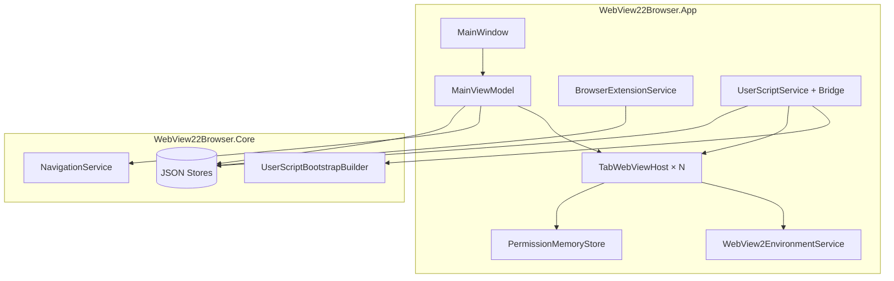

# WebView22Browser

基于 [Microsoft WebView2](https://developer.microsoft.com/microsoft-edge/webview2/) 的 WPF 多标签浏览器。采用 **MVVM** 与 **多项目分层**，通过 **Microsoft.Extensions.DependencyInjection** 装配，将可测试的核心逻辑与 WebView2 宿主解耦。

> 🤖 **重要说明**：本项目由 AI 主导代码编写、代码审查与功能演进，仓库全部内容（除本说明与 LICENSE 以外）由 AI 生成。

---

## 功能一览

| 类别 | 能力 |
| --- | --- |
| **多标签** | 每个标签独立 `WebView2` 实例，`Ctrl+T` / `Ctrl+W` / `Ctrl+Tab` 切换；关闭最后一个标签时自动打开主页 |
| **地址栏** | `http(s)://` 直链；`localhost`、IP、含 `.` 的主机名自动补 `https://`；`file://` 本地文件；其余输入走可配置的搜索引擎 |
| **导航** | 后退 / 前进 / 刷新 / 停止 / 主页；状态栏显示加载和下载摘要 |
| **新标签手势** | `Ctrl + 点击`、中键点击、右键菜单「在新标签页中打开」 |
| **共享会话** | 全部标签共用同一 `CoreWebView2Environment` 与用户数据目录，Cookie / 登录态跨标签共享 |
| **收藏夹** | 左侧可折叠面板，添加 / 删除 / 双击打开，写入 `favorites.json` |
| **Chromium 扩展** | 右侧可折叠面板，安装**本地已解压**的扩展（含 `manifest.json`）；启动时按注册表自动重装 |
| **用户脚本** | 右侧可折叠面板，按 URL 匹配规则注入 JavaScript；支持 `@grant` / `@connect`；可检查与已启用扩展的 URL 冲突 |
| **下载** | 弹出 Windows「另存为」；底部下载中心展示进度、暂停 / 取消、「在文件夹中显示」、打开文件；历史写入 `download-history.json` |
| **浏览历史** | 全屏历史页（工具栏按钮或 `Ctrl+H`），按日期分组、关键字搜索、单条删除或清空，写入 `browsing-history.json` |
| **证书与权限** | HTTPS 证书错误弹窗确认（仅当会话有效）；地理位置、摄像头等首次弹窗，结果按站点 + 权限类型记忆 |
| **稳定性** | 渲染进程崩溃最多自动恢复 3 次；`F12` 开发者工具 |
| **标签页休眠** | 分层节能（降内存 → `TrySuspend` → 销毁控件）+ 系统压力自适应；会话写入 `tabs-session.json` 支持崩溃/重启后懒唤醒恢复标签与历史栈 |

---

## 技术栈

| 组件 | 版本 / 说明 |
| --- | --- |
| .NET | 8.0（App 为 `net8.0-windows` + WPF） |
| WebView2 SDK | `Microsoft.Web.WebView2` 1.0.3967.48 |
| MVVM | `CommunityToolkit.Mvvm` 8.4.2 |
| 配置与 DI | `Microsoft.Extensions.Configuration.Json`、`DependencyInjection` 10.0.8 |
| 测试 | xUnit（`WebView22Browser.Tests`，不依赖 WebView2 运行时） |

---

## 解决方案结构

```plaintext
WebView22Browser.sln
├── WebView22Browser.App/          # WPF 界面与 WebView2 宿主
├── WebView22Browser.Core/         # 无 WebView2 依赖的核心逻辑
└── WebView22Browser.Tests/        # 单元测试
```

### WebView22Browser.App

| 目录 / 文件 | 职责 |
| --- | --- |
| `ViewModels/` | `MainViewModel`、`BrowserTabViewModel`、`FavoritesViewModel`、`ExtensionsViewModel`、`UserScriptsViewModel`、`DownloadsViewModel`、`HistoryViewModel` 等 |
| `Controls/TabWebViewHost` | 单标签 WebView2 生命周期、事件接线、进程恢复 |
| `Services/` | 环境创建、扩展安装、权限记忆、对话框、下载、标签宿主、休眠调度、用户脚本桥接（GM 存储 / XHR / 标签 / 剪贴板） |
| `Views/` | 收藏夹 / 扩展 / 用户脚本侧栏、下载中心底栏、历史记录全屏页 |
| `WebView2/` | 错误映射、右键菜单、新标签手势检测 |
| `App.xaml.cs` | 读取 `appsettings.json`、注册 DI、启动 `MainWindow` |

### WebView22Browser.Core

| 目录 / 文件 | 职责 |
| --- | --- |
| `Services/NavigationService` | 地址栏输入 → 最终 URI（含搜索回退） |
| `Services/NavigationErrorPolicy` / `Formatter` | 是否展示导航错误及文案 |
| `Services/ExtensionPathValidator` / `ExtensionManifestReader` | 校验扩展目录、读取 `manifest.json` |
| `Services/TabSleepPolicy` / `TabNavigationHistory` / `TabHistoryRestorer` | 后台标签休眠判定、URL 历史栈与唤醒恢复步骤 |
| `Services/UserScriptMetadataParser` | 解析 `// ==UserScript== ... ==/UserScript==` 块 |
| `Services/UserScriptBootstrapBuilder` | 生成注入 JS：URL 匹配、GM API、每脚本 nonce |
| `Services/UserScriptMessageValidator` | 校验来自页面的 `gm.*` / `notify` / `log` 消息 |
| `Services/UserScriptConnectMatcher` | `@connect` 白名单匹配（`*` / `self` / 主机 / 子域通配） |
| `Services/UserScriptConflictDetector` | 用户脚本与 Chromium 扩展的 URL 模式重叠检测 |
| `Services/BrowsingHistory*` | 历史分组、搜索过滤、标题格式化、写入策略 |
| `Stores/` | `JsonFavoritesStore`、`JsonExtensionSourceStore`、`JsonUserScriptStore`、`JsonGmStorageStore`、`JsonDownloadHistoryStore`、`JsonBrowsingHistoryStore` |
| `Models/` | `FavoriteItem`、`UserScriptEntry`、`BrowsingHistoryEntry`、`GmXhrRequest` / `GmCookie`、`BrowserErrorStatus` 等 |
| `BrowserOptions` | 主页、搜索模板、历史上限、休眠参数、各类本地数据路径 |

### 架构关系（简图）



---

## 环境要求

- [.NET 8 SDK](https://dotnet.microsoft.com/download/dotnet/8.0)
- [Microsoft Edge WebView2 Runtime](https://developer.microsoft.com/microsoft-edge/webview2/)（Evergreen 常青版）

---

## 构建与运行

仓库根目录：

```powershell
dotnet build
dotnet test
dotnet run --project WebView22Browser.App
```

`dotnet test` 仅运行 Core 与 ViewModel 层逻辑，无需安装 WebView2 运行时。

生产发布：

```powershell
dotnet publish WebView22Browser.App -c Release -r win-x64 --self-contained false
```

发布包依赖目标机器已安装 WebView2 常青运行时。

---

## 应用配置

编辑 `WebView22Browser.App/appsettings.json`：

```json
{
  "Browser": {
    "HomeUrl": "https://www.bing.com",
    "SearchUrlTemplate": "https://www.bing.com/search?q={0}",
    "TabSleepTimeoutMinutes": 5,
    "TabSleepCheckIntervalSeconds": 30,
    "RestoreLastSession": true,
    "PressureElevatedMemoryPercent": 70,
    "PressureHighMemoryPercent": 85,
    "PressureHighCpuPercent": 80,
    "PressureSampleWindowSeconds": 15
  }
}
```

| 键 | 说明 |
| --- | --- |
| `HomeUrl` | 主页按钮与新建标签默认地址 |
| `SearchUrlTemplate` | 非 URL 输入时的搜索地址，`{0}` 为经 `Uri.EscapeDataString` 编码的查询词 |
| `TabSleepTimeoutMinutes` | 非选中标签闲置多少分钟后进入休眠阶梯；`0` 禁用 |
| `TabSleepCheckIntervalSeconds` | 休眠扫描间隔（秒） |
| `RestoreLastSession` | 启动时从 `tabs-session.json` 恢复标签与 URL 历史栈（默认 `true`；当前选中标签立即初始化，其余标签懒唤醒） |
| `PressureElevatedMemoryPercent` | 系统内存占用达到该百分比时，压力等级升为 Elevated（有效超时 ×0.5） |
| `PressureHighMemoryPercent` | 系统内存占用达到该百分比时，可升为 High（有效超时 ×0.2，并加速销毁） |
| `PressureHighCpuPercent` | 本进程 CPU 与 Elevated 内存组合达到 High 的辅助阈值 |
| `PressureSampleWindowSeconds` | 压力采样 EMA 窗口（秒） |

`BrowserOptions` 还支持代码级覆盖 `UserDataRoot`、各 JSON 持久化文件路径、`BrowsingHistoryMaxEntries`、`DownloadHistoryMaxEntries`、`TabHistoryMaxEntries`（测试与高级部署用）。

---

## 本地数据存储

默认根目录：`%LocalAppData%\WebView22Browser\`

| 路径 | 内容 |
| --- | --- |
| `UserData\Profile\` | WebView2 用户数据（Cookie、缓存、Session、已安装扩展） |
| `favorites.json` | 收藏夹列表 |
| `extensions.json` | 已安装扩展的源目录注册表（用于重装） |
| `permissions.json` | 站点权限记忆（按 URI + 权限类型） |
| `download-history.json` | 下载历史（默认上限 200 条） |
| `browsing-history.json` | 浏览访问历史（默认上限 2000 条） |
| `userscripts.json` | 用户脚本（名称、`@match` / `@exclude`、`runAt`、仅顶层框架、`grants`、`connect`、`code`、启用状态） |
| `tabs-session.json` | 上次会话的标签列表、选中标签、每标签 URL 历史栈（原子写入，供重启恢复） |
| `gm-storage/<scriptId>.json` | 各用户脚本的 GM 键值存储（JSON 可序列化值） |

WebView2 环境创建时启用 `AreBrowserExtensionsEnabled = true`。

---

## 快捷键与手势

| 输入 | 操作 |
| --- | --- |
| `Ctrl + T` | 新建标签 |
| `Ctrl + W` | 关闭当前标签 |
| `Ctrl + Tab` | 切换到下一个标签 |
| `Ctrl + H` | 打开 / 关闭历史记录页 |
| `Esc` | 历史记录页打开时关闭 |
| `F12` | 打开 / 关闭开发者工具 |
| 地址栏 `Enter` | 导航或搜索 |
| `Ctrl + 点击` 链接 | 在新标签打开 |
| 中键点击链接 | 在新标签打开 |

---

## 标签页休眠

`TabSleepService` 按闲置时长与系统压力（内存 / 本进程 CPU）对**非选中**后台标签执行三层动作：

| 阶段 | 动作 | 说明 |
| --- | --- | --- |
| 1 | `MemoryUsageTargetLevel = Low` | 闲置 ≥ 0.5×有效超时 |
| 2 | `TrySuspendAsync` + `Resume` | 闲置 ≥ 1×有效超时；轻量挂起，唤醒几乎无等待，保留 DOM / SPA 状态 |
| 3 | 销毁 WebView2 控件 | 闲置 ≥ 2×有效超时，或 High 压力下 ≥ 1.5×有效超时；冻结 URL 历史快照（标签条 💤） |

**有效超时**：Normal 为 `TabSleepTimeoutMinutes`；Elevated ×0.5；High ×0.2。

再次选中标签时 `WakeAsync()`：若仅轻量挂起则 `Resume()`；若已销毁则重建 WebView2 并按 `TabHistoryRestorer` 重放 `Navigate` / `GoBack`（最多 `TabHistoryMaxEntries` 条，默认 50）。

**会话恢复**：退出时将标签与历史栈写入 `tabs-session.json`（原子替换）。`RestoreLastSession=true` 时恢复全部标签；**当前选中的标签立即初始化**（可直接浏览），其余标签以休眠占位懒唤醒（点击后 `WakeAsync()`）。`RestoreLastSession=false` 时仅打开主页。

**不会进入休眠：**

- 当前选中标签
- 正在加载（`IsLoading`）
- 正在播放音频（`CoreWebView2.IsDocumentPlayingAudio`）
- 存在进行中的下载（`ActiveDownloadCount > 0`）

**历史恢复的限制（WebView2 无 Travellog API）：**

- 仅恢复 **URL 级** 线性历史（应用层在 `NavigationCompleted` 时维护），不恢复 SPA 内存状态、未提交表单或仅 `pushState` 无完整导航的条目。
- 轻量挂起（`TrySuspend`）可保留页面内存状态；仅销毁控件路径依赖 URL 重放。
- 共享 `Profile` 的 Cookie / 登录态仍保留在用户数据目录中。

---

## 扩展程序

1. 在工具栏打开「扩展」侧栏。
2. 点击「从文件夹安装」，选择**已解压**的扩展根目录（必须包含 `manifest.json`）。
3. 通过 WebView2 Profile API 安装；源路径记录在 `extensions.json`，下次启动自动尝试重装。
4. 不支持 Chrome Web Store 在线安装；仅本地文件夹。

---

## 用户脚本

1. 在工具栏打开「用户脚本」侧栏，可手动添加或从 `.user.js` 文件导入。
2. 支持元数据：`@name`、`@match` / `@include`、`@exclude`、`@run-at`（`document-start` / `-end` / `-idle`）、`@noframes`、`@grant`、`@connect`。
3. 脚本在 `document-created` 时由宿主注入；用户代码经 `new Function('GM', 'unsafeWindow', code)` 包装执行，与页面共享 JS 世界（非 Tampermonkey 级隔离世界），但无法访问 bootstrap 闭包内的鉴权信息。
4. **`@grant` 支持的 GM API**：
   - 存储：`GM_setValue`、`GM_getValue`、`GM_deleteValue`、`GM_listValues`
   - 网络：`GM_xmlhttpRequest`
   - UI / 系统：`GM_log`、`GM_info`、`GM_notification`、`GM_addStyle`、`GM_openInTab`、`GM_setClipboard`（仅 `text`）
   - 未声明 `@grant` 等同 `@grant none`，所有 GM 函数不可见
   - `GM_registerMenuCommand` 当前为占位（调用抛错）
5. **GM 存储语义**：
   - 注入时从 `gm-storage/<scriptId>.json` 预加载键值到闭包；读取走内存（同步）。
   - 写入先更内存，再 `postMessage` 异步落盘；宿主异常退出可能导致未持久化。
   - 同脚本在其他已打开标签中**不会实时看到**新写入；需刷新页面后重新注入才可见。
   - 限额：单值默认 ≤ 256 KB，单脚本总量默认 ≤ 5 MB；超限写入被宿主拒绝并记入 Debug 日志。
6. **`@connect` 白名单**：
   - 未声明 `@connect` 时等价于 `@connect self`（仅允许与 `@match` 同源主机匹配的目标）。
   - 支持 `*` / `self` / `example.com` / `*.example.com` 等模式。
   - 不在白名单内的跨站请求由宿主拒绝，并通过 `__wv2dispatch` 回传 error。
7. **桥接与安全**：
   - 每个启用脚本在注入时分配独立 **nonce**；特权消息（`gm.*`）须携带 `{ scriptId, nonce }`，由 `UserScriptMessageValidator` 校验。
   - 消息来源必须为 `http(s)://` 或 `file://` 页面 URL。
   - `GM_xmlhttpRequest`：宿主用源标签 `CookieManager` 读取目标 URL 的 Cookie 注入请求头；响应 `Set-Cookie` **不写回**，避免污染会话。
   - 响应体上限 **10 MB**；`HttpClient` 总超时 **2 分钟**；不支持流式 / `onprogress`、`responseType=document`、`Set-Cookie` 回写、`binary` / `synchronous` 选项。
   - `__wv2dispatch` 通过不可配置的 `Object.defineProperty` 注册；XHR 结果用 `ExecuteScriptAsync` 投递，降低被页面 `message` 监听嗅探的概率。
   - 共享 Cookie 风险：脚本可借用户登录态访问已 `@connect` 的站点（与 Tampermonkey 同级高权限能力）。
8. **冲突检查**：在保存或导入脚本时，自动比对已启用 Chromium 扩展的 content script `matches`，列出可能在相同 URL 同时运行的项。
9. 修改脚本列表后需**刷新已打开标签**方生效。

---

## 证书与权限

**证书错误**：访问自签名或过期 HTTPS 时弹窗。用户选择「继续」后，当前会话内对该主机有效。每次启动会调用 `ClearServerCertificateErrorActionsAsync`，**重启后需重新确认**。

**权限**：首次请求敏感权限时弹窗；结果延迟约 3 秒批量写入 `permissions.json`。同站点、同权限类型再次访问时自动应用历史选择。

---

## 性能建议

每个标签对应独立 WebView2 实例以保证隔离与稳定。受内存限制，**建议同时打开的标签不超过 10 个**；其余可借助标签休眠降低开销。

---

## 测试覆盖概览

| 测试类（按主题分组） | 覆盖范围 |
| --- | --- |
| `NavigationService` / `NavigationErrorPolicy` / `NavigationErrorFormatter` | URI 解析、搜索回退、`localhost` / `file`、错误展示策略与文案 |
| `JsonFavoritesStore` / `FavoritesViewModel` | 收藏持久化与 ViewModel |
| `JsonExtensionSourceStore` / `ExtensionPathValidator` / `ExtensionManifestReader` | 扩展注册表、路径校验、`manifest.json` 解析 |
| `JsonUserScriptStore` / `UserScriptMetadataParser` / `UserScriptUrlMatcher` (含 JS 同构) / `UserScriptConflictDetector` | 用户脚本持久化、元数据解析、URL 匹配语义、与扩展的冲突检测 |
| `UserScriptBootstrapBuilder` / `UserScriptMessageValidator` / `UserScriptConnectMatcher` | 注入脚本构建、消息鉴权、`@connect` 白名单 |
| `JsonGmStorageStore` / `GmStorageMessageHandler` / `GmXhrService` / `GmXhrMessageHandler` | GM 键值持久化、配额、XHR 执行与消息处理 |
| `JsonBrowsingHistoryStore` / `BrowsingHistoryPolicy` / `Grouper` / `Search` / `TitleFormatter` / `HistoryViewModel` | 历史记录写入、分组、搜索、ViewModel |
| `JsonDownloadHistoryStore` / `DownloadItemViewModel` / `DownloadProgressFormatter` | 下载历史、进度文本 |
| `MainViewModel` / `BrowserOptions` / `PermissionMemoryStore` / `WebView2ErrorMapper` | 标签命令、配置、权限记忆、WebView2 错误映射 |
| `TabSleepPolicy` / `TabNavigationHistory` / `TabHistoryRestorer` / `TabSessionSnapshotBuilder` / `JsonTabSessionStore` | 分层休眠判定、URL 历史栈、唤醒恢复、会话持久化 |

---

## 许可证

MIT License
