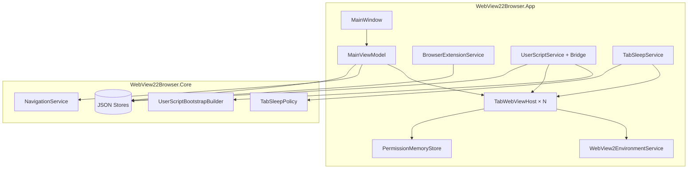
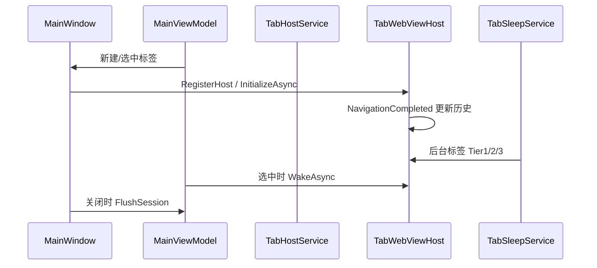

# 架构

[← 文档索引](README.md)

## 解决方案结构

```plaintext
WebView22Browser.sln
├── WebView22Browser.App/          # WPF 界面与 WebView2 宿主
├── WebView22Browser.Core/         # 无 WebView2 依赖的核心逻辑
└── WebView22Browser.Tests/        # 单元测试（引用 App + Core）
```

| 项目 | TFM | 说明 |
| --- | --- | --- |
| App | `net8.0-windows` | WPF `WinExe`，WebView2 SDK |
| Core | `net8.0` | 类库，无 NuGet 依赖 |
| Tests | `net8.0-windows` | xUnit，不启动真实 WebView2 |

## 分层职责

| 层 | 职责 | 示例 |
| --- | --- | --- |
| **Core** | URI 解析、策略、JSON 持久化、用户脚本匹配/注入字符串、休眠判定 | `NavigationService`、`TabSleepPolicy`、`Json*Store` |
| **App** | WPF、WebView2 事件、GM 桥、下载、扩展安装、权限 UI | `TabWebViewHost`、`UserScriptBridge`、`WebView2DownloadService` |
| **Tests** | Core + 选定 App 服务/ViewModel，Fakes 替代 IO | `MainViewModelTests`、`GmXhrServiceTests` |

**不宜单测**：`TabWebViewHost` 与真实 WebView2 控件（见 [testing.md](development/testing.md)）。

## WebView22Browser.App

| 目录 / 文件 | 职责 |
| --- | --- |
| `ViewModels/` | `MainViewModel`、`BrowserTabViewModel`、`FavoritesViewModel`、`ExtensionsViewModel`、`UserScriptsViewModel`、`DownloadsViewModel`、`HistoryViewModel`、`SettingsViewModel` 等 |
| `Controls/TabWebViewHost` | 单标签 WebView2 生命周期、事件、进程恢复、查找、休眠唤醒 |
| `Services/` | 环境、扩展、权限、下载、标签宿主、休眠、用户脚本与 GM |
| `Views/` | 侧栏、下载底栏、历史/设置全屏页 |
| `WebView2/` | 错误映射、右键菜单、新标签手势 |
| `App.xaml.cs` | 配置加载、DI、启动 `MainWindow` |

## WebView22Browser.Core

| 目录 / 文件 | 职责 |
| --- | --- |
| `Services/NavigationService` | 地址栏 → URI |
| `Services/NavigationErrorPolicy` / `Formatter` | 导航错误展示 |
| `Services/ExtensionPathValidator` / `ExtensionManifestReader` | 扩展校验 |
| `Services/TabSleepPolicy` / `TabNavigationHistory` / `TabHistoryRestorer` | 休眠与历史恢复 |
| `Services/UserScript*` | 元数据、匹配、注入、bootstrap、消息校验、`@connect`、冲突检测 |
| `Services/BrowsingHistory*` | 历史策略、分组、搜索、标题 |
| `Stores/` | 各 `Json*Store` |
| `BrowserOptions` | 合并后的运行时配置与路径 |

## UI 布局

[MainWindow.xaml](../WebView22Browser.App/MainWindow.xaml) 四列：收藏夹 | 主浏览区 | 用户脚本 | 扩展。主区含标签条、工具栏、地址栏、`TabWebViewHost`、状态栏、下载面板；历史/设置为全屏叠加层。

## 依赖注入注册（Singleton）

在 [App.xaml.cs](../WebView22Browser.App/App.xaml.cs) `ConfigureServicesAsync` 中注册：

| 类型 | 实现 / 说明 |
| --- | --- |
| `BrowserAppConfig` | 自 `appsettings.json` 解析 |
| `BrowserOptions` | `BrowserOptionsLoader.Load` |
| `IUserSettingsStore` | `JsonUserSettingsStore` |
| `NavigationService` | 地址栏逻辑 |
| `WebView2EnvironmentService` | 共享 Environment |
| `IFavoritesStore` | `JsonFavoritesStore` |
| `IExtensionSourceStore` | `JsonExtensionSourceStore` |
| `IUserScriptStore` | `JsonUserScriptStore` |
| `GmStorageQuota` | GM 配额默认值 |
| `IGmStorageStore` | `JsonGmStorageStore` |
| `UserScriptBootstrapBuilder` | 注入脚本生成 |
| `HttpClient` | GM XHR（无 Cookie 自动管理，2 分钟超时） |
| `IGmXhrService` | `GmXhrService` |
| `GmXhrMessageHandler` | XHR 消息处理 |
| `WpfGmTabService` / `IGmTabService` | `GM_openInTab` |
| `IGmClipboardService` | `WpfGmClipboardService` |
| `GmMenuCommandRegistry` | 脚本命令菜单 |
| `UserScriptBridge` / `UserScriptService` | 注入与消息桥 |
| `ExtensionManifestReader` | manifest 读取 |
| `UserScriptExtensionConflictService` | 与扩展冲突检查 |
| `UserScriptImportService` | `.user.js` 导入 |
| `BrowserExtensionService` | 扩展安装 |
| `PermissionMemoryStore` | 权限记忆 |
| `IDialogService` / `IDesktopService` | `WpfDialogService` / `WpfDesktopService` |
| `IDownloadHistoryStore` / `IBrowsingHistoryStore` | JSON 存储 |
| `DownloadsViewModel` | 下载 UI 状态 |
| `IBrowsingHistoryService` | `BrowsingHistoryService` |
| `HistoryViewModel` / `SettingsViewModel` | 历史/设置页 |
| `IDownloadService` | `WebView2DownloadService` |
| `ITabHostService` | `TabHostService` |
| `ISystemPressureMonitor` | `SystemPressureMonitor` |
| `ITabSessionStore` | `JsonTabSessionStore` |
| `TabSleepService` | 休眠调度 |
| `IRuntimeBrowserSettingsApplier` | → `TabSleepService` |
| `FavoritesViewModel` / `ExtensionsViewModel` / `UserScriptsViewModel` / `UserScriptCommandsViewModel` | 侧栏与菜单 |
| `MainViewModel` | 标签与导航中枢 |
| `Lazy<MainViewModel>` | 延迟解析 |
| `MainWindow` | 主窗口 |

启动后额外接线：`WpfGmTabService.SetOpenHandler`、`FavoritesViewModel.NavigateToFavorite`、`HistoryViewModel.NavigateToUrl`。

## 架构关系



## 标签生命周期（简图）



## 相关文档

- [configuration.md](configuration.md) — 配置加载
- [data-storage.md](data-storage.md) — 持久化路径
- [development/testing.md](development/testing.md) — 测试边界
