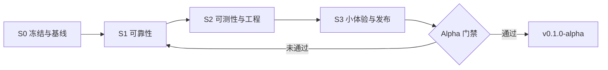

# Alpha 阶段收尾计划

[← 文档索引](../README.md)

本文档基于仓库当前实现与文档（截至 `main` 分支梳理），用于 **Alpha 功能冻结 → 可靠性加固 → 可发布标签** 的收口工作。大范围重构与 Beta 级能力见文末「推迟项」。

相关文档：

- [架构](../architecture.md)、[测试](testing.md)、[CI 与发布](ci-and-release.md)
- 功能限制：[用户脚本](../features/user-scripts.md)、[休眠与会话](../features/tab-sleep-and-session.md)、[扩展](../features/extensions.md)

---

## 一、项目当前状态快照

### 定位

基于 [Microsoft WebView2](https://developer.microsoft.com/microsoft-edge/webview2/) 的 WPF 多标签浏览器：MVVM + `WebView22Browser.Core` / `WebView22Browser.App` 分层，依赖注入集中在 [App.xaml.cs](../../WebView22Browser.App/App.xaml.cs)。

### 能力矩阵（已基本成型）

| 域 | 状态 |
| --- | --- |
| 多标签 / 导航 / 手势开新标签 | 可用 |
| 收藏夹、扩展（本地解压）、用户脚本 + GM API | 可用 |
| 下载中心、浏览历史、证书 / 权限 | 可用 |
| 标签休眠 + 会话恢复（`tabs-session.json`） | 可用 |
| 设置页（主页、搜索、休眠、压力、历史上限等） | 可用 |

### 工程健康度

| 指标 | 说明 |
| --- | --- |
| 测试规模 | 约 **373** 条用例；CI 在 `windows-latest` 全量执行 |
| Linux 开发 | **382** 条全绿（S2：`ITabWebViewHost` + `ImmediateUiThreadMarshaller`，见 [AGENTS.md](../../AGENTS.md)） |
| CI 门禁 | restore → `dotnet format --verify-no-changes` → Release build → test |
| 发布 | 标签 `v*` → [release.yml](../../.github/workflows/release.yml) 产出 win-x64 zip |
| 文档 | [doc/](../) 覆盖架构、功能与已知限制 |

### 复杂度热点

| 文件 | 约行数 | 说明 |
| --- | ---: | --- |
| `Controls/TabWebViewHost`（partial） | ~1200 合计 | 已按生命周期 / 导航历史 / 安全权限 / 下载手势拆分；**最大集成面，无单测** |
| [UserScriptBootstrapBuilder.cs](../../WebView22Browser.Core/Services/UserScriptBootstrapBuilder.cs) | ~560 | 注入脚本生成 |
| [MainViewModel.cs](../../WebView22Browser.App/ViewModels/MainViewModel.cs) | ~390 | 标签与导航协调中枢 |

### 已接受的产品 / 平台限制（非 Alpha 缺陷 backlog）

以下行为已在 README 与 `doc/features/*` 中说明，收尾期**不**当作待修 bug，但应写入 Alpha Release Notes：

- 扩展仅**本地已解压目录**，无 Chrome Web Store
- 用户脚本与页面**共享 JS 世界**（非 Tampermonkey 隔离世界）
- 会话恢复仅 **URL 历史栈**，无 SPA 表单 / `pushState` 状态
- `GM_xmlhttpRequest` 无流式 / `onprogress`、无 `Set-Cookie` 回写
- PDF 内页查找不完整（WebView2 限制）
- 文档建议同时活跃标签 **≤ 10**（当前无 UI 提示）
- `RestoreLastSession` 需**完整重启浏览器**后生效
- HTTPS 证书 `AlwaysAllow` 为**会话级**，启动时清除（见 [security-and-permissions.md](../features/security-and-permissions.md)）

---

## 二、架构优化 / 重构建议

按 **收益 / 改动比** 排序。标有 **Beta** 的项不纳入 Alpha 收尾必做。

### P0 — Alpha 收尾建议完成（改动可控）

| 建议 | 现状问题 | 预期收益 |
| --- | --- | --- |
| ~~消除 `TabWebViewHost` 中的 Service Locator~~（**S2 已完成**） | 已改为 `ConfigureHost` + `ITabHostCallbacks`；见 [architecture.md](../architecture.md) | 可测性、依赖清晰 |
| 为 Host 定义窄接口回调 | 如 `ITabReadyNotifier`、`IBrowserOptionsAccessor`，经 `MainWindow.RegisterHost` 注入 | 与 VM 解耦，便于后续拆分文件 |
| ~~统一 JSON 持久化基类~~（**S1 已完成**） | 侧栏与用户数据 JSON 均已 **temp + replace** 原子写入：`JsonFileStoreBase` 子类（[JsonFavoritesStore](../../WebView22Browser.Core/Stores/JsonFavoritesStore.cs)、[JsonExtensionSourceStore](../../WebView22Browser.Core/Stores/JsonExtensionSourceStore.cs)、[JsonUserScriptStore](../../WebView22Browser.Core/Stores/JsonUserScriptStore.cs)、[JsonDownloadHistoryStore](../../WebView22Browser.Core/Stores/JsonDownloadHistoryStore.cs)、[JsonBrowsingHistoryStore](../../WebView22Browser.Core/Stores/JsonBrowsingHistoryStore.cs)）+ [JsonTabSessionStore](../../WebView22Browser.Core/Stores/JsonTabSessionStore.cs) / [JsonUserSettingsStore](../../WebView22Browser.Core/Stores/JsonUserSettingsStore.cs) / [JsonGmStorageStore](../../WebView22Browser.Core/Stores/JsonGmStorageStore.cs) / [PermissionMemoryStore](../../WebView22Browser.App/Services/PermissionMemoryStore.cs) 调用 `JsonFileStoreBase.WriteAtomicAsync` | 降低崩溃时 JSON 损坏风险 |
| `ITabHostService` 不暴露 WPF 类型 | 接口返回 [TabWebViewHost](../../WebView22Browser.App/Controls/TabWebViewHost.xaml.cs) | Linux 上 `MainViewModelTests` 可用 Fake；App/Core 边界更清晰 |
| 收敛 `async void` | `TabSleepService.OnTimerTick`、`App.OnStartup`、多处 Loaded 事件 | 减少未观察异常与定时器重入 |

### P1 — Beta 前逐步推进（中等改动）

| 建议 | 说明 |
| --- | --- |
| ~~拆分 `TabWebViewHost`~~（**已完成**） | `TabWebViewHost.{Lifecycle,NavigationHistory,Security,GesturesAndDownloads}.cs` partial |
| DI 模块化 | `App.xaml.cs` 注册拆为 `AddBrowserCore()` / `AddUserScripts()` 等扩展方法 |
| 核心服务补接口 | `UserScriptService`、`TabSleepService`、`PermissionMemoryStore` 等目前为具体 Singleton |
| Json Store 模板化 | `Load` / `Save` / `Clear` + 可选 `SemaphoreSlim` + `WriteAtomicAsync` 一套实现 |

### P2 — 明确推迟（**Beta** 或更远）

- 用户脚本隔离世界（多 Profile / 复杂注入）
- 扩展商店 / 在线更新
- 多窗口、账户同步、隐私模式
- WebView2 集成 / E2E 自动化测试体系

---

## 三、建议新增功能（小改动）

**原则**：单 PR 可 review、不牵动 `TabWebViewHost` 全量重写。

| 功能 | 改动面 | 说明 |
| --- | --- | --- |
| 关于 / 版本信息 | 设置页或「更多」菜单 | 程序集版本 + WebView2 Runtime 版本，便于 alpha 反馈 |
| 标签数软提示 | 状态栏 | 活跃标签 > 10 时提示（对齐 [getting-started.md](../getting-started.md)） |
| 清除浏览数据 | 设置页按钮 | 调用 WebView2 Profile API 清 Cookie/缓存（不删侧栏 JSON 数据） |
| `GM_openInTab` 后台打开 | [UserScriptBridge](../../WebView22Browser.App/Services/UserScriptBridge.cs) | `active: false` 当前被忽略 |
| 脚本 / 休眠失败状态栏提示 | `TabSleepService`、`UserScriptBridge` | 将仅 `Debug.WriteLine` 的失败升级为用户可见消息 |
| 跨标签 GM 存储同步（轻量） | `GmStorageMessageHandler` | 持久化后向其他 Host 广播，减轻「需刷新才见」困惑 |
| 重复当前标签 | `MainViewModel` | 复制 URL，可选复制历史栈 |
| 收藏夹导出 / 导入 JSON | 复用 `JsonFavoritesStore` | 本地备份，无云同步 |
| 快捷键：刷新全部标签（脚本） | 绑定已有刷新全部 Host 逻辑 | 配合 [user-scripts.md](../features/user-scripts.md) 工作流 |
| 损坏 JSON 恢复提示 | 各 Store `catch JsonException` | 一次性对话框，优于静默丢数据 |

### 明确排除（大范围）

Chrome Web Store、Tampermonkey 级隔离、完整 Travellog / SPA 状态恢复、GM XHR 流式与 Cookie 回写、多窗口、账户同步。

---

## 四、需改进的错误 / 风险点

### 高优先级（Alpha 收尾应处理）

1. ~~**JSON 写入非原子**~~（**S1 已修复**）— 历史风险；现行实现见 [data-storage.md](../data-storage.md)「写入约定」与各 `Json*Store` / `PermissionMemoryStore`。
2. **`PermissionMemoryStore` 静默失败** — 防抖 flush 存在空 `catch (Exception)`。
3. **`TabWebViewHost` 无自动化测试** — 最大回归盲区（见 [testing.md](testing.md)）。
4. **Fire-and-forget 异步** — `_ = WakeAsync` / GM 消息等，异常可能未记录。
5. **`TabSleepService.OnTimerTick` 为 `async void`** — 定时器与 `await` 重叠可能重入；会话 flush 失败仅 Debug 输出。
6. **GM 高权限面** — `GM_xmlhttpRequest` 注入页面 Cookie；须在 Release Notes 标明「仅安装可信脚本」。

### 中优先级（可记入 Beta backlog）

| 风险 | 表现 |
| --- | --- |
| 导航 `_navigationWaiter` 单例 | 快速连续导航可能互相覆盖 |
| 浏览历史上限懒加载 | 经 `App.Services` 取 `BrowserOptions`，改设置后需新 Host 才生效 |
| 依赖预取不走 `@connect` | 与 XHR 策略不一致；恶意 `@require` URL 消耗宿主网络 |
| Linux / CI 测试不一致 | 贡献者在 Linux 看到 14 失败易误判项目损坏 |
| DevTools 默认开启 | 适合 alpha；正式版可考虑设置项 |

### 低优先级（文档或 UX 提示即可）

- PDF 查找、WebView2 证书 API 仅 `AlwaysAllow` / `Cancel`
- 用户脚本修改后仍需刷新标签（已有「刷新全部标签」，可加强发现性）

---

## 五、收尾执行计划（Sprint）

以 **可发布 alpha 标签 + 可维护** 为收口标准，避免收尾期功能蔓延。

### S0 — 冻结与基线

**目标**：明确 Alpha 边界，建立验收基线。

| 任务 | 类型 |
| --- | --- |
| 整理 **Alpha 已知限制清单**（摘录 README + `doc/features/*`） | 文档 |
| 完成 **translate 手动验收**（[user-scripts.md § 清单](../features/user-scripts.md#translate-手动验收清单)）并记录结果 | 手工 |
| Windows 冒烟：冷启动 → 多标签 → 休眠 → 杀进程 → 会话恢复 → 扩展重装 → 脚本 → 下载 → 历史 | 手工 |
| 确认 `main` CI 全绿（format + test + CodeQL 无新增 critical） | 工程 |

**出口标准**：可附在 GitHub Release 的「限制说明 + 验收勾选表」。

**S0 交付物**（2026-05-20）：

- [alpha-known-limitations.md](alpha-known-limitations.md) — Release Notes 限制说明草稿
- [alpha-s0-acceptance.md](alpha-s0-acceptance.md) — 工程基线 + translate / 冒烟勾选记录

---

### S1 — 可靠性（最高 ROI 代码）

**目标**：降低数据损坏与静默失败。

| 任务 | 涉及模块 |
| --- | --- |
| 抽取 `JsonFileStoreBase`（temp + replace，可选 `SemaphoreSlim`） | `JsonFavoritesStore`、`JsonExtensionSourceStore`、`JsonUserScriptStore`、`JsonDownloadHistoryStore`、`PermissionMemoryStore` 等 |
| `PermissionMemoryStore` flush 失败：日志 + 可选重试 / 提示 | [PermissionMemoryStore.cs](../../WebView22Browser.App/Services/PermissionMemoryStore.cs) |
| `TabSleepService` 会话 flush 失败 → 状态栏 | [TabSleepService.cs](../../WebView22Browser.App/Services/TabSleepService.cs) |
| `UserScriptBridge` 宿主异常 → 状态栏或页面 `console.error` | [UserScriptBridge.cs](../../WebView22Browser.App/Services/UserScriptBridge.cs) |

**出口标准**：关键 JSON 均为原子或等效安全写；权限 / 会话 / GM 宿主失败用户可感知。

---

### S2 — 可测性与架构债（小步）

**目标**：为 Beta 铺路；**不**在本 Sprint 拆分 `TabWebViewHost` 大文件。

| 任务 | 涉及模块 |
| --- | --- |
| `ITabHostService` 改为能力接口或 Fake 友好抽象 | `TabHostService`、`MainViewModel`、`MainWindow` |
| `FakeTabHost` + 修复 / 标注 `MainViewModelTests` | [MainViewModelTests.cs](../../WebView22Browser.Tests/MainViewModelTests.cs) |
| `TabWebViewHost` 注入 `BrowserOptions` / 回调接口，移除 Service Locator | [TabWebViewHost.xaml.cs](../../WebView22Browser.App/Controls/TabWebViewHost.xaml.cs) |
| `TabSleepService` 定时逻辑单测（Fake Host + 可控时钟） | 新测试类 |

**出口标准**：Windows CI 全绿；Linux 测试结果与文档一致（全绿或跳过原因明确）。

---

### S3 — 小体验 + Alpha 发布

**目标**：可对外分发的 alpha 包。

| 任务 | 类型 |
| --- | --- |
| 设置页「关于」+ WebView2 Runtime 版本 | 功能 |
| 活跃标签 > 10 软提示 | 功能 |
| 「清除浏览数据」 | 功能 |
| `GM_openInTab` 支持 `active: false` | 功能 |
| 脚本「刷新全部标签」快捷键 | 功能 |
| `CHANGELOG.md` 或 Release Notes 初版 | 文档 |
| 打标签 **`v0.1.0-alpha`**，触发 [release.yml](../../.github/workflows/release.yml) | 发布 |

**出口标准**：GitHub Release 含 zip、限制说明、手动验收表。

---

## 六、Alpha 门禁（Go / No-Go）

### 必须通过

| 类别 | 条件 |
| --- | --- |
| CI | `dotnet format --verify-no-changes` + Release build + **Windows 上全部 test 通过** |
| 数据 | 收藏 / 脚本 / 扩展 / 权限 / 会话等关键 JSON 安全写 |
| 安全 | Release Notes 标明 GM / 扩展高权限；证书绕过为会话级 |
| 文档 | 限制清单 + translate 验收 + [getting-started.md](../getting-started.md) |
| 手工 | 会话恢复、扩展重装、下载、历史、证书弹窗、权限记忆各验证 1 次 |

### 不挡 Alpha 标签（进 Beta backlog）

- ~~`TabWebViewHost` 文件拆分~~（已完成）
- E2E / WebView2 集成测试
- Chrome Web Store、隔离世界、GM XHR 完整 Tampermonkey 兼容

---

## 七、Alpha 之后 → Beta 首批（规划参考）

1. ~~拆分 `TabWebViewHost`~~（已完成；见 `Controls/TabWebViewHost.*.cs`）
2. GM XHR `onprogress` 与可选 `responseType` 扩展
3. 设置项：DevTools 默认策略、证书说明文案
4. 最小 smoke（可选）：启动 + 单 URL 导航（Playwright 或 WinAppDriver 等）

---

## 八、任务勾选总表

便于 Issue / PR 跟踪；完成时在 PR 中引用本文件章节。

### S0

- [x] Alpha 已知限制清单（Release Notes 草稿）→ [alpha-known-limitations.md](alpha-known-limitations.md)
- [x] translate 手动验收 → [alpha-s0-acceptance.md](alpha-s0-acceptance.md)（步骤 1–4 通过，步骤 5 待补）
- [x] Windows 冒烟路径 → [alpha-s0-acceptance.md](alpha-s0-acceptance.md)（核心路径通过；历史/证书待 S3 前补）
- [x] `main` CI 全绿确认 → [alpha-s0-acceptance.md](alpha-s0-acceptance.md)

### S1

- [x] `JsonFileStoreBase`（或等效）+ 迁移各 Store
- [x] `PermissionMemoryStore` 错误可观测
- [x] `TabSleepService` flush 失败提示
- [x] `UserScriptBridge` 宿主失败提示

### S2

- [x] `ITabHostService` 抽象 / Fake
- [x] `MainViewModelTests` Linux/Windows 一致
- [x] `TabWebViewHost` 去除 Service Locator
- [x] `TabSleepService` 单测

### S3

- [x] 关于 / 版本
- [x] 标签数提示
- [x] 清除浏览数据
- [x] `GM_openInTab` `active: false`
- [x] 刷新全部标签快捷键
- [x] `CHANGELOG` / Release Notes
- [ ] 标签 `v0.1.0-alpha` + Release 产物

### 门禁

- [ ] 第六节 Go 条件全部满足

---

## 修订记录

| 日期 | 说明 |
| --- | --- |
| 2026-05-20 | 初版：基于 `main` 代码与文档梳理 |
| 2026-05-20 | S0 完成：限制清单、验收记录、勾选表更新 |
| 2026-05-20 | S1 完成：`JsonFileStoreBase`、原子 JSON 写、权限/会话/GM 失败状态栏提示 |
| 2026-05-20 | S2 完成：`ITabWebViewHost`/`ITabHostCallbacks`、`FakeTabWebViewHost`、`TabSleepCycleProcessor` 单测、Linux 全绿 |
| 2026-05-20 | S3 完成（除标签发布）：关于/版本、标签提示、清除浏览数据、`GM_openInTab`、`Ctrl+Shift+R`、`CHANGELOG.md` |
| 2026-05-21 | 文档：`alpha-wrap-up` P0/风险 §4 与 `data-storage` 对齐 S1 后各 JSON Store 原子写现状 |
| 2026-05-21 | P1：`TabWebViewHost` 拆为 partial（Lifecycle / NavigationHistory / Security / GesturesAndDownloads） |
